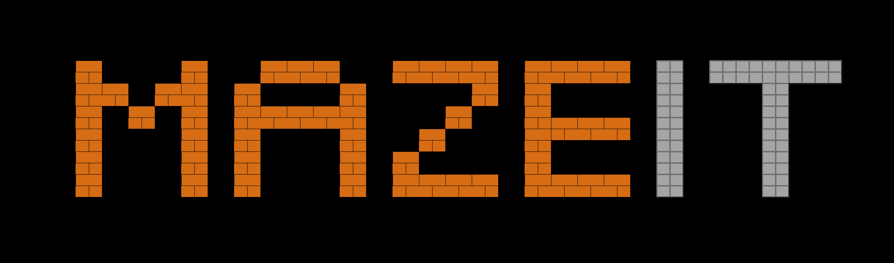
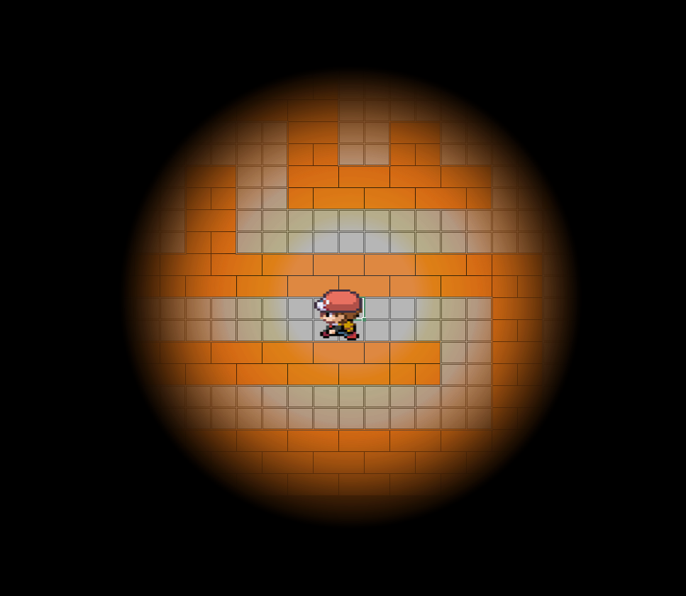
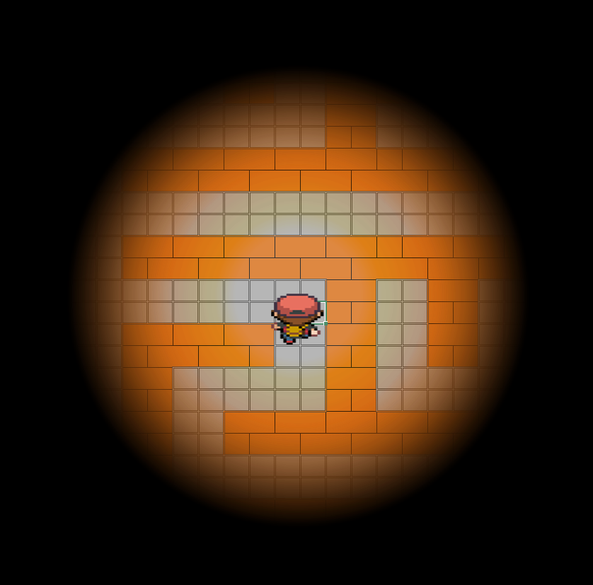

## Maze Game - VBA in Excel

Welcome to **Maze Game**, a pixel-art style maze game created using VBA in Excel! The game features a character that navigates through a dark maze with limited visibility, needing to find both a key and an exit to win. The game is built entirely using Excel cells for the maze layout, and movement is controlled with the arrow keys.

### Game Overview

- **Objective**: Navigate through a maze, find a hidden key, and reach the exit.
- **Challenge**: The maze is mostly dark, with light only around your character, making navigation more difficult.
- **Key Feature**: You must first locate the key before you can exit the maze.

   

### Game Files

1. **Maze_Game.xlsm**:
   - This is the Excel file that contains the maze and the VBA code needed to run the game.
   - Download and open the file in Excel to start playing.

2. **VBA_Code.vba**:
   - The full VBA code for the game, allowing you to implement the same logic and gameplay in your own Excel workbooks.
   - If you'd like to customize the game or use your own maze and images, follow the instructions below.

### How to Play

1. **Opening the Game**:
   - Open **Maze_Game.xlsm** in Excel.
   - Make sure macros are enabled. If prompted by Excel, click "Enable Macros" to allow the VBA code to run.
   
2. **Starting the Game**:
   - Once the file is open, click the **"Start"** button or press **Alt + F8** and select `Start` from the list of macros to begin.
   - Use the **arrow keys** to move your character through the maze (Up, Down, Left, Right).
   - As you move, the visible area around your character will change, showing only a small portion of the maze.

3. **Objective**:
   - **Find the Key**: You must locate a hidden key before you can exit the maze. The key will disappear once collected.
   - **Exit the Maze**: After finding the key, navigate to the exit door to win the game.

4. **End Game**:
   - When you reach the exit with the key, a "GG" message will pop up indicating you’ve won!

### Understanding the VBA Code

You can find the VBA code for the game in the **VBA_Code.vba** file. This file includes all the logic required to move the character, check for walls, interact with the key, and detect the exit.

#### How It Works:

- **Movement**: The arrow keys are tied to movement functions in the VBA code. Each direction (`Up`, `Down`, `Left`, `Right`) is handled by its respective subroutine. The code checks the color of nearby cells to detect walls and prevent movement through them.
  
- **Walls**: The code checks for walls by comparing the color of the maze cells. Cells representing walls are filled with a specific color (RGB 214, 108, 20). The VBA code prevents the character from moving into these wall cells.

- **Key and Exit**: When the player reaches the key’s location (a specific cell), the key is marked as found. After finding the key, the player can then move to the exit to win the game.

### Customizing the Game

If you’d like to modify or create your own maze, or add different images for the character, follow these steps:

1. **Import the VBA Code**:
   - Open your Excel file and press **Alt + F11** to open the VBA editor.
   - In the VBA editor, you can import the **VBA_Code.vba** file by going to **File > Import File**, then selecting the file.
   
2. **Maze Layout**:
   - Design your maze in Excel using cells. Cells filled with the RGB color (214, 108, 20) represent walls, and the character will be blocked from moving through them.

3. **Character Images**:
   - In the code, different images represent the character facing different directions.
   - If you want to use your own images, update the references to the shapes (e.g., `"Picture 12"`, `"Picture 19"`) to match the names of your new images.
     - Example: Replace `"Picture 12"` with `"Your_Image_Name"` in the corresponding direction subroutine.
   - You can find the image names by selecting the image in Excel and checking the "Name Box" in the upper left corner.

4. **Adjusting Starting Position**:
   - In the `Start` subroutine, you can adjust the character's starting position by changing the range (currently `"BH94"`). Modify this to point to the desired starting cell.

5. **Adjusting Key and Exit Locations**:
   - Modify the `Selection.Address` checks in the `MoveImage` subroutine to change where the key is located (currently at `"$BP$41"`) and the exit (currently at `"$FI$94"`).

### Conclusion

Have fun customizing and playing the Maze Game in Excel! If you run into any issues or need further guidance, feel free to explore the VBA code for more details on how it works. Enjoy the challenge of finding the key and escaping the maze!
